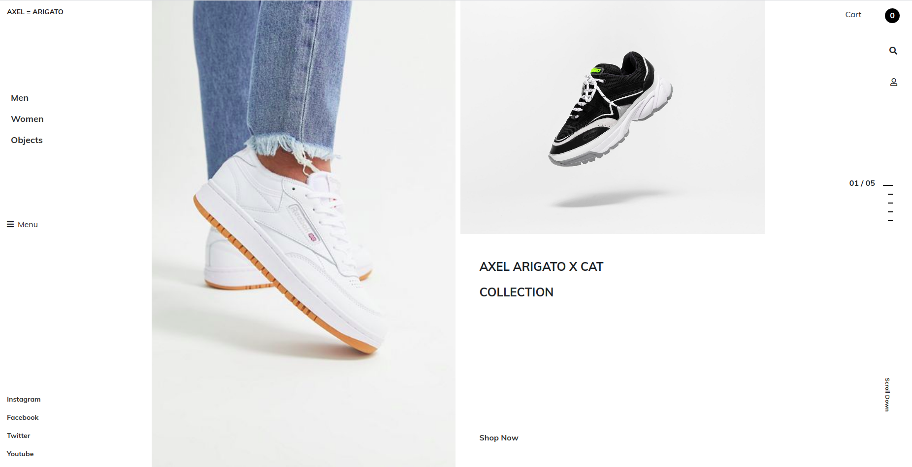

# E-Sneaker Shop
Design idea by [Dmitry Oxygen in Dribbble](https://dribbble.com/oxygen_dima)

> The purpose of this project is to learn about media queries and responsive design with bootstrap.  
> The website is an ecommerce platform for sneakers, which give visitors the chance to have a feel of their favorite sneaker online.
> It presents a 360 view of sneakers and their prices.

## Built With

- HTML 5
- CSS 3
- Bootstrap 4.4

## Live Demo

[Live Demo Link](https://intense-sea-62929.herokuapp.com/)

## Authors

👤 **Solomon Appier-Sign**

- Github: [@githubhandle](https://github.com/appiersign)
- Twitter: [@appiersign](https://twitter.com/appiersign)
- Linkedin: [linkedin](https://www.linkedin.com/in/solomon-appier-sign/)

## 🤝Contributing

This project is for educational purposes only, suggestions are accepted, but no contributions.

## Show Your Support

Kindly give me a star if you like this project
